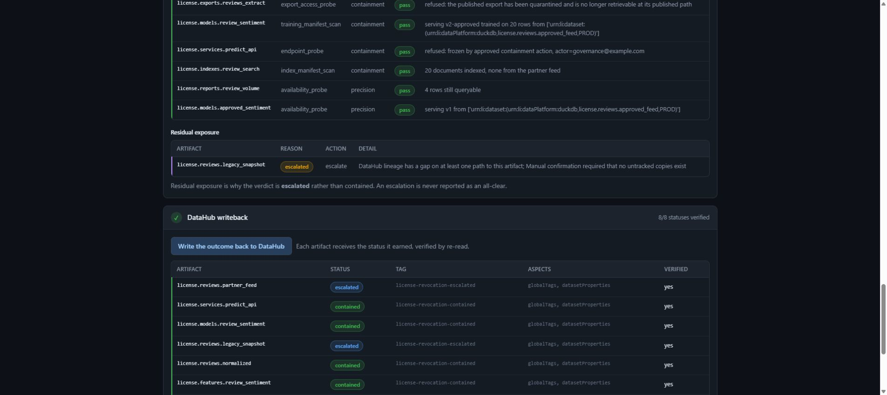
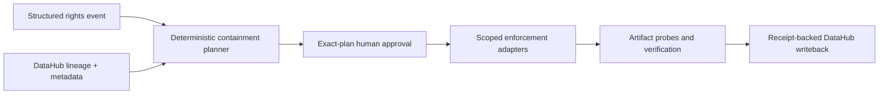

# License Circuit Breaker

[](https://github.com/amathias/license-circuit-breaker/actions/workflows/ci.yml)

**Executable data-rights revocation with DataHub.**

Revoke one upstream data right and contain every affected downstream artifact.

License Circuit Breaker reads DataHub lineage to find every dataset, feature table, model,
RAG index, endpoint, and export affected by a revoked data license; produces a
deterministic containment plan; refuses to act without human approval; executes real
actions on local artifacts; verifies by probing those artifacts rather than trusting its
own receipts; and writes the outcome back to DataHub.

> It supports compliance operations. It does not provide legal advice, does not interpret
> contract text, and makes no determination about whether any obligation has been met.

[Open the live judge console](https://license.datahub-hackathon.aaronmathias.com) ·
[View the source](https://github.com/amathias/license-circuit-breaker) ·
[Watch the public demo](https://youtu.be/42FznbyhYlA) ·
[Follow the under-three-minute recording runbook](docs/DEMO_RECORDING.md)

Demo video: **[public on YouTube](https://youtu.be/42FznbyhYlA)** (2:18, English captions).

Catalogs and governance tools can display provenance or warn that a license is
incompatible. The operational gap begins after the warning: somebody still has to find and
disable every downstream use. This closes that gap and proves it closed.



_Local executable workflow evidence: downstream artifacts were probed directly and 8/8 DataHub
status writes were verified by reread. The anonymous hosted console is intentionally read-only._

## Architecture



## Three-step judge path

1. Open the live console and inspect the structured rights event plus DataHub-derived impact graph.
2. Build the containment plan, try the server-side refusal, then approve the exact plan hash.
3. Execute containment and inspect artifact probes, residual exposure, and verified writeback.

No credentials are needed. The quickstart below reproduces the demo locally with no catalog and no
network.

---

## Quickstart

Requires Python 3.12+. Node 20+ is optional — it builds the console, and the API and the
CLI run without it.

```bash
python -m venv .venv
.venv/Scripts/python.exe -m pip install -e ".[dev]"     # Windows
# .venv/bin/python -m pip install -e ".[dev]"           # macOS / Linux

cp .env.example .env
```

Set `APP_ENV=offline` in `.env`. That selects the deterministic in-memory DataHub
substitute, so the entire demo runs with no catalog, no credentials, and no network.

### The demo, in four commands

```bash
python -m demo.cli estate build          # build the disposable local data estate
python -m demo.cli probe                 # partner content is being served
python -m demo.cli contain --approve     # plan, approve, execute, verify, write back
python -m demo.cli probe                 # the same probes now refuse
```

`contain` **exits 9, not 0** — and that is the correct result. One descendant reaches the
estate through a lineage path DataHub cannot complete, so it is escalated rather than
reported contained, and any verdict short of `contained` is a non-zero exit. A run that
exited 0 here would be claiming an all-clear it had not earned.

Drop `--approve` to watch the gate refuse instead: the plan is computed in full, nothing is
touched, and the command exits 8.

`examples/containment-report.md` is a captured run of exactly this, if you would rather
read the output than produce it.

### The judge console

```bash
npm --prefix web install
npm --prefix web run build          # writes web/dist
python -m app.main                  # http://127.0.0.1:8102
```

FastAPI serves the built console at `/` and the API under `/api`. The static mount is added
last so it can never shadow a route, and if `web/dist` is absent the API still runs — the
console is optional, not a dependency.

For console development, `npm --prefix web run dev` serves on `:5173` and proxies `/api` to
`:8102`.

---

## What the demo shows

The estate is built from two review feeds — one licensed from a partner, one internally
approved — and the partner feed reaches eight downstream artifacts. The rights event
revokes **training** and **retrieval** on it and retains **analytics**, which is what makes
the unaffected branch provable rather than asserted.

| Stage | What to look at |
|---|---|
| 1. Exposure | The prediction API, the vector index, and the CSV export all serve partner-derived content |
| 2. Rights event | Structured data with a content hash, not prose handed to a model |
| 3. DataHub impact | Lineage comes from the catalog, classification and action from the rule table — shown separately, so you can see which produced which |
| 4. Policy | Eight decisions, each citing a rule ID and a complete lineage path |
| 5. Approval | Bound to one exact plan hash; regenerate the plan and the approval stops applying |
| 6. Containment | Freeze, purge, rebuild, retrain, replace, quarantine — idempotent and resumable |
| 7. Verification | Probes read the artifacts, never the receipts, so a skipped action cannot pass |
| 8. Writeback | Per-artifact revocation status and evidence reference, each confirmed by re-read |

The analytics report and the approved model are probed too, and must stay **available**.
Containment that broke the branch it was supposed to leave alone would be a false success,
so verification fails on over-reach as well as under-reach.

### The refusals are the product

- `POST /api/execute` answers **409** with the reason unless a recorded approval covers that
  exact plan. The gate is server-side, so it holds for anything that can reach the port —
  and the console's Execute button is deliberately left enabled so a judge can watch it
  refuse rather than find it greyed out.
- A contained endpoint answers **451 Unavailable For Legal Reasons**, not 404 or 500. A
  judge watching the network tab can tell containment from an outage.
- `GET /api/readiness` answers **503** when degraded, with the full check list in the body.
- Anything outside the `license.` namespace is refused before a single write is built.

---

## Real, simulated, and which is which

**Real:** every local artifact change. The DuckDB tables, the TF-IDF index, the model
manifests, and the published CSV are genuinely rebuilt, purged, quarantined, and replaced,
then re-read to confirm it.

**Simulated:** under `APP_ENV=offline`, DataHub reads and writeback run against an
in-memory substitute with the same client surface and the same namespace guard. Everything
produced in that mode is stamped `simulated: true`, the console shows a banner, and the
evidence report opens with one.

**No live DataHub evidence is committed to this repository.** Everything under
`examples/`, and every receipt produced by the quickstart above, is stamped
`simulated: true`.

The deployed build has separately been verified against a live DataHub 1.6 instance by
the deployment coordinator: readiness returned 10/10 with 12 active entities and 9
lineage edges, and a reversible catalog writeback was confirmed by re-read and then
rolled back. That run happened on the deployment host and its receipts stay there — it
is recorded in [COORDINATOR_HANDOFF.md](./COORDINATOR_HANDOFF.md) and is **not**
reproducible from this checkout, which is why nothing here is labelled as live.

---

## Repository map

| Path | What is in it |
|---|---|
| `app/` | Config, rights model, policy engine, approvals, execution, verification, evidence, API |
| `adapters/` | DataHub client (MCP reads, SDK writeback), the in-memory fake, containment adapters |
| `demo/` | The disposable data estate, the fixture graph, serving endpoints, and the CLI |
| `policy/rules.yaml` | The deterministic rule table every decision cites |
| `web/` | The judge console (React + TypeScript, no runtime dependency beyond React) |
| `examples/` | A rights event, an impact plan, and a captured containment report |
| `docs/DECISIONS.md` | Architectural decision records |
| `tests/` | Lineage traversal, policy, approval gates, adapter failure, verification, packaging |

## Verification

Interactive Swagger, ReDoc, and the generated OpenAPI document are enabled by default for local,
development, and test use at `/docs`, `/redoc`, and `/openapi.json`. The unauthenticated public
judge deployment disables those routes. The source, typed UI client, tests, and this README remain
the public API and self-hosting reference.

```bash
.venv/Scripts/python.exe -m ruff check .
.venv/Scripts/python.exe -m pytest tests/ -m "not slow"    # the working suite
.venv/Scripts/python.exe -m pytest tests/                  # adds the archive-install gate
npm --prefix web run typecheck
```

The `slow` marker covers two tests that assemble a shippable archive and install it into an
isolated virtualenv. They take minutes, and they exist because a package that imports but
cannot seed, slice, or load a single rule is not a working package.

## Known limitations

- The receipt ledger is hash-chained and tamper-**evident**, not tamper-proof.
- Purpose metadata is read from custom properties this project seeds.
- Every fixture entity is a `dataset` URN carrying an `artifact_class` custom property, so
  the model and the feature table appear in DataHub as datasets on the `mlflow` and `feast`
  platforms rather than as native `mlModel` and `mlFeatureTable` entities. DataHub 1.6.0
  registers neither `datasetProperties` nor `upstreamLineage` on those types, so a native
  entity cannot carry the properties the policy engine reads or the lineage the impact
  analysis walks. The trade-off and its cost are recorded in
  [ADR-024](./docs/DECISIONS.md).
- Containment covers descendants represented in the DataHub graph. Untracked copies and
  offline extracts are not addressed, and stopping a model from serving is not proof that
  it has unlearned its training data.
- Seed and reset are not mutually exclusive across processes; the demo assumes a single
  operator.

## Project documents

- [Submission copy](./SUBMISSION.md) — the Devpost submission of record
- [Demo recording runbook](./docs/DEMO_RECORDING.md) — the recording sequence and its stop
  conditions
- [Demo and submission guide](./DEMO_AND_SUBMISSION.md)
- [Project brief](./PROJECT_BRIEF.md) · [Build plan](./BUILD_PLAN.md)
- [Architectural decisions](./docs/DECISIONS.md)
- [Coordinator handoff](./COORDINATOR_HANDOFF.md)
- [Builder instructions](./AGENTS.md) · [Hackathon rules](./HACKATHON_RULES.md)

## Submission

Primary category: **Production ML Agents** — the reasoning is in
[SUBMISSION.md](./SUBMISSION.md). Built new during the
submission period. Licensed Apache 2.0 — see [LICENSE](./LICENSE).
